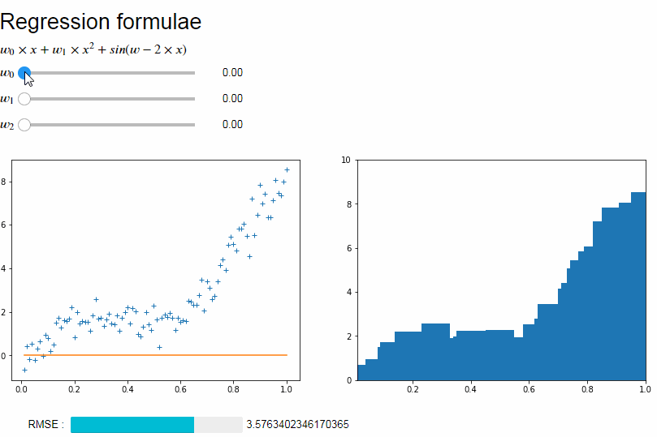

# Ipywidgets notebooks on regression for an internal talk

[](http://beta.mybinder.org/v2/gh/andfanilo/cotrecs_20181109/master?filepath=demo2.ipynb)

In this repo, you will find a bunch of notebooks I wrote for building widgets that demonstrate a regression to a somewhat arbitrary function.



# Setup / Run

You will need [Conda](https://conda.io/miniconda.html) to install a conda environment.

```
conda env create -f environment.yml
conda activate demo
jupyter notebook
``` 
